<a id="readme-top"></a>
# Awesome Nano Banana Pro Images ✨

[](LICENSE)
[](README.md)
[](README_zh.md)
<a href="https://github.com/linksee-dev/awesome-nano-banana-pro-prompt/stargazers">
  
</a>

🎉 Welcome to the curated collection of images generated by Nano Banana Pro!

This is a curated collection of images and prompts generated by Nano Banana Pro. It highlights Nano Banana AI's cutting-edge capabilities in AI image generation and continues to expand the creative possibilities of AI.

Most examples come from Twitter/X 🐦 and Gemini 🎬. May they spark ideas 💡 and turbo‑charge your creativity 🚀.

<strong>→ 喜欢就点 Star 支持！ / Smash that ⭐ if you like it!</strong>

---

<a id="table-of-contents"></a>
## Contents

- [🎨 What is Nano Banana Pro](#nano-banana-pro-intro)
- [📖 Cases Directory](#cases-toc)
- [🛠️ Tools Introduction](#tools-intro)
- [💡 Prompting Tips](#prompting-tips)
- [🤝 How to Contribute](#how-to-contribute)
- [🙏 Acknowledgements](#acknowledgements)
- [💰 Sponsored](#sponsored)
- [🌟 Star History](#star-history)


---

<a id="nano-banana-pro-intro"></a>
## 🎨 What is Nano Banana Pro

Nano Banana Pro (Gemini 3 Pro Image) is Google DeepMind's new state-of-the-art image generation and editing model, built on Gemini 3 Pro. It uses Gemini's state-of-the-art reasoning and real-world knowledge to visualize information better than ever before.

Nano Banana Pro not only turns text prompts into high‑quality images but also offers powerful image‑to‑image editing—enabling targeted retouching, style transfer, and multi‑image blending.

### Core Features

- 🧠 **Enhanced Reasoning & Knowledge**: Leverages Gemini 3's advanced reasoning to generate more accurate, context-rich visuals based on enhanced reasoning, world knowledge and real-time information
- ✍️ **Multilingual Text Rendering**: Generate accurate, legible text in multiple languages within images, perfect for mockups, posters, and international content
- 🎨 **Multi-Image Blending**: Blend up to 14 images while maintaining consistency and resemblance of up to 5 people, easily turning sketches into products or blueprints into photorealistic 3D structures
- 🖼️ **Studio-Quality Creative Controls**: Advanced creative controls including localized editing, camera angle adjustments, focus control, sophisticated color grading, and scene lighting transformations (e.g., day to night, bokeh effects)
- 📐 **High-Resolution Output**: Support for multiple aspect ratios with 2K and 4K resolution options, ready for any platform from social media to print
- ⚡️ **Consistency by Design**: Ensure seamless and consistent branding across every touchpoint

### Use Cases

- 📊 Visualize data as infographics
- 📝 Turn handwritten notes into diagrams
- 🎬 Create prototypes and concept designs
- 🎨 Produce high-fidelity visuals and branded content
- 🌍 Generate multilingual international content

*Learn more: [Introducing Nano Banana Pro](https://blog.google/technology/ai/nano-banana-pro/)*


---

<a id="cases-toc"></a>
## 📖 Cases Directory

*   [Case 29: Pet Meme Creation (by )](#cases-29)
*   [Case 28: 3D Blind Box Style Avatar (by )](#cases-28)
*   [Case 27: Digital Content Localization (Comics/Memes) (by )](#cases-27)
*   [Case 26: Physical Store/Travel Translation (by )](#cases-26)
*   [Case 25: Commercial Promotional Poster (by )](#cases-25)
*   [Case 24: Viral Cover Image (Youtube/Douyin/TikTok) (by )](#cases-24)
*   [Case 23: Hard Furnishing Preview (Floor Plan to Design) (by )](#cases-23)
*   [Case 22: Smart Crowd Removal (by )](#cases-22)
*   [Case 21: Composition Rescue (Smart Outpainting) (by )](#cases-21)
*   [Case 20: Magazine Layout Generator (by @fofrAI)](#cases-20)
*   [Case 19: UI Hand-drawn Sketch to High-Fidelity Prototype (by )](#cases-19)
*   [Case 18: Hand-drawn Flowchart to Corporate Charts (by )](#cases-18)
*   [Case 17: Professional Product Photography (by )](#cases-17)
*   [Case 16: Virtual Model Try-On (by )](#cases-16)
*   [Case 15: Concept Visualization (Text to Infographic) (by )](#cases-15)
*   [Case 14: Whiteboard Marker Art (by @nicdunz)](#cases-14)
*   [Case 13: Multi-Subject Compositing (by )](#cases-13)
*   [Case 12: Literal Interpretation (by )](#cases-12)
*   [Case 11: Conceptual Visualization (by )](#cases-11)
*   [Case 10: Coordinate Visualization (by )](#cases-10)
*   [Case 9: Recursive Visuals (by @venturetwins)](#cases-9)
*   [Case 8: Aging Through the Years (by @dr_cintas)](#cases-8)
*   [Case 7: Star Wars "Where's Waldo" (by @creacas)](#cases-7)
*   [Case 6: Emotional Film Photography (by )](#cases-6)
*   [Case 5: One-Click Business Photo (Silicon Valley Style) (by )](#cases-5)
*   [Case 4: 1990s Camera Style Portrait (by @kingofdairyque)](#cases-4)
*   [Case 3: Victoria's Secret Style Photoshoot (by @NanoBanana_labs)](#cases-3)
*   [Case 2: 2000s Mirror Selfie (by @ZaraIrahh)](#cases-2)
*   [Case 1: Hyper-Realistic Crowd Composition (by @SebJefferies)](#cases-1)

---

<a id="cases"></a>
## 🧩 Case

<a id="cases-29"></a>
### Case 29: Pet Meme Creation (by [](https://mp.weixin.qq.com/s/lrYNbs4rGs3KOqewoZ6aNQ))

[Source Link](https://mp.weixin.qq.com/s/lrYNbs4rGs3KOqewoZ6aNQ)

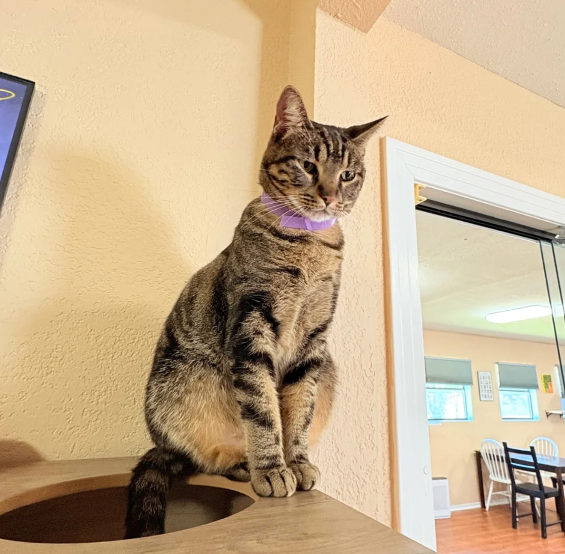<br>
<sub>Image © 2025 <a href="https://mp.weixin.qq.com/s/lrYNbs4rGs3KOqewoZ6aNQ"></a>, <a href="https://creativecommons.org/licenses/by/4.0/">CC BY 4.0</a> • Prompt by <a href="https://mp.weixin.qq.com/s/lrYNbs4rGs3KOqewoZ6aNQ"></a></sub>

**Prompt**

```
Turn this photo of my [cat/dog] into a funny hand-drawn WeChat sticker . Style : Minimalist ugly-cute line drawing (doodle style). White background. Expression : Exaggerate the animal's expression to look extremely shocked/judgemental/lazy (based on photo). Accessories : Add cute little doodles like sweat drops, question marks, or sparkles around the head. Text : Add handwritten text at the bottom: 'So Dumb'. Ensure the text style is messy and funny.
```


---

[⬆️ Back to Cases Directory](#cases-toc)

<a id="cases-28"></a>
### Case 28: 3D Blind Box Style Avatar (by [](https://mp.weixin.qq.com/s/lrYNbs4rGs3KOqewoZ6aNQ))

[Source Link](https://mp.weixin.qq.com/s/lrYNbs4rGs3KOqewoZ6aNQ)

<br>
<sub>Image © 2025 <a href="https://mp.weixin.qq.com/s/lrYNbs4rGs3KOqewoZ6aNQ"></a>, <a href="https://creativecommons.org/licenses/by/4.0/">CC BY 4.0</a> • Prompt by <a href="https://mp.weixin.qq.com/s/lrYNbs4rGs3KOqewoZ6aNQ"></a></sub>

**Prompt**

```
Transform the person in the uploaded photo into a cute 3D Pop Mart style blind box character . Likeness : Keep key features recognizable: [hair color, glasses, hairstyle]. Style : C4D rendering, occlusion render, cute Q-version , soft studio lighting, pastel colors. Background : A simple, solid matte color background (e.g., soft blue). Detail : The character should have a smooth, plastic toy texture with a slight glossy finish. Facing forward, friendly expression.
```


---

[⬆️ Back to Cases Directory](#cases-toc)

<a id="cases-27"></a>
### Case 27: Digital Content Localization (Comics/Memes) (by [](https://mp.weixin.qq.com/s/lrYNbs4rGs3KOqewoZ6aNQ))

[Source Link](https://mp.weixin.qq.com/s/lrYNbs4rGs3KOqewoZ6aNQ)

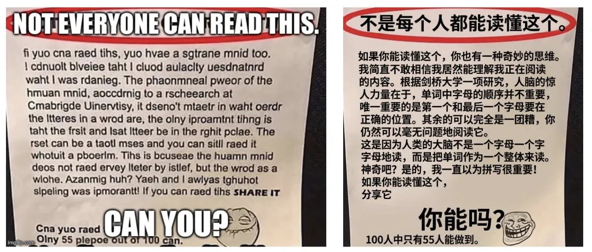<br>
<sub>Image © 2025 <a href="https://mp.weixin.qq.com/s/lrYNbs4rGs3KOqewoZ6aNQ"></a>, <a href="https://creativecommons.org/licenses/by/4.0/">CC BY 4.0</a> • Prompt by <a href="https://mp.weixin.qq.com/s/lrYNbs4rGs3KOqewoZ6aNQ"></a></sub>

**Prompt**

```
Translate the text in the speech bubbles/captions from [Japanese/English] to [Chinese]. Seamless Cleaning : Erase the original text and perfectly fill the background (e.g., the white speech bubble or the colored image background). Style Matching : Render the translated Chinese text using a casual, handwritten-style font (or bold impact font for memes) that matches the aesthetic of the original image. Fit : Ensure the text fits naturally within the bubbles without overcrowding.
```


---

[⬆️ Back to Cases Directory](#cases-toc)

<a id="cases-26"></a>
### Case 26: Physical Store/Travel Translation (by [](https://mp.weixin.qq.com/s/lrYNbs4rGs3KOqewoZ6aNQ))

[Source Link](https://mp.weixin.qq.com/s/lrYNbs4rGs3KOqewoZ6aNQ)

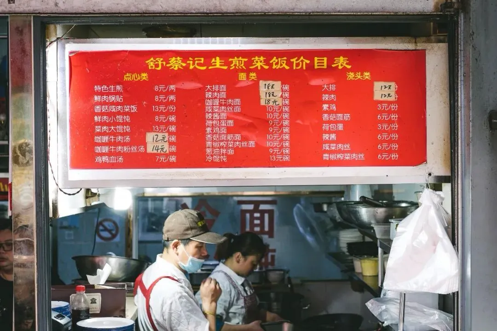<br>
<sub>Image © 2025 <a href="https://mp.weixin.qq.com/s/lrYNbs4rGs3KOqewoZ6aNQ"></a>, <a href="https://creativecommons.org/licenses/by/4.0/">CC BY 4.0</a> • Prompt by <a href="https://mp.weixin.qq.com/s/lrYNbs4rGs3KOqewoZ6aNQ"></a></sub>

**Prompt**

```
Translate the Chinese dish names on the wall menu into English for foreign tourists. Texture Preservation : Crucial! Maintain the original aged, greasy, and textured look of the wall/paper. The new English text should look like it was written/printed on the same surface, with slight fading or wear to match. Currency : Keep the '¥' symbol and price numbers exactly as they are ; do not convert currency. Layout : align the English translations next to or replacing the Chinese characters naturally.
```


---

[⬆️ Back to Cases Directory](#cases-toc)

<a id="cases-25"></a>
### Case 25: Commercial Promotional Poster (by [](https://mp.weixin.qq.com/s/lrYNbs4rGs3KOqewoZ6aNQ))

[Source Link](https://mp.weixin.qq.com/s/lrYNbs4rGs3KOqewoZ6aNQ)

<br>
<sub>Image © 2025 <a href="https://mp.weixin.qq.com/s/lrYNbs4rGs3KOqewoZ6aNQ"></a>, <a href="https://creativecommons.org/licenses/by/4.0/">CC BY 4.0</a> • Prompt by <a href="https://mp.weixin.qq.com/s/lrYNbs4rGs3KOqewoZ6aNQ"></a></sub>

**Prompt**

```
Design a professional promotional poster for a [Coffee Shop]. Composition : A cinematic close-up of a steaming cup of cappuccino on a rustic wooden table, autumn leaves in the background (cozy atmosphere). Text Integration :
1. Main Title : 'Autumn Special' written in elegant, gold serif typography at the top.
2. Offer : 'Buy One Get One Free' clearly displayed in a modern badge or sticker style on the side.
3. Footer : 'Limited Time Only' in small, clean text at the bottom. Quality : Ensure all text is perfectly spelled, centered, and integrated into the image's depth of field.
```


---

[⬆️ Back to Cases Directory](#cases-toc)

<a id="cases-24"></a>
### Case 24: Viral Cover Image (Youtube/Douyin/TikTok) (by [](https://mp.weixin.qq.com/s/lrYNbs4rGs3KOqewoZ6aNQ))

[Source Link](https://mp.weixin.qq.com/s/lrYNbs4rGs3KOqewoZ6aNQ)

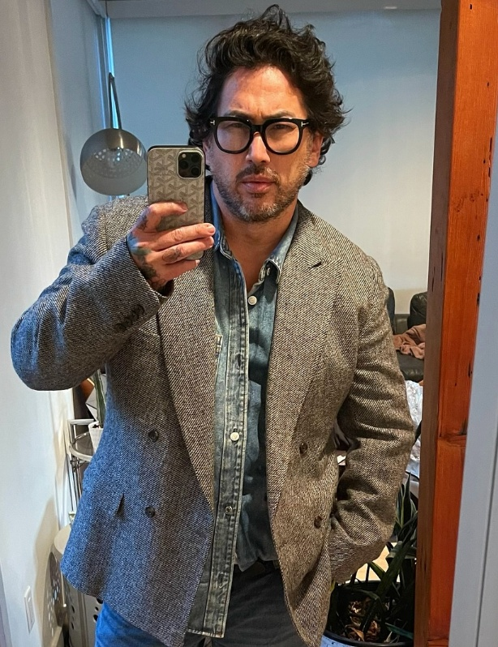<br>
<sub>Image © 2025 <a href="https://mp.weixin.qq.com/s/lrYNbs4rGs3KOqewoZ6aNQ"></a>, <a href="https://creativecommons.org/licenses/by/4.0/">CC BY 4.0</a> • Prompt by <a href="https://mp.weixin.qq.com/s/lrYNbs4rGs3KOqewoZ6aNQ"></a></sub>

**Prompt**

```
Design a viral video thumbnail using the person from Image 1. Face Consistency : Keep the person's facial features exactly the same as Image 1 , but change their expression to look excited and surprised . Action : Pose the person on the left side, pointing their finger towards the right side of the frame. Subject : On the right side, place a high-quality image of [a delicious avocado toast]. Graphics : Add a bold yellow arrow connecting the person's finger to the toast. Text : Overlay massive, pop-style text in the middle: '3分钟搞定!' (Done in 3 mins!). Use a thick white outline and drop shadow. Background : A blurred, bright kitchen background. High saturation and contrast.
```


---

[⬆️ Back to Cases Directory](#cases-toc)

<a id="cases-23"></a>
### Case 23: Hard Furnishing Preview (Floor Plan to Design) (by [](https://mp.weixin.qq.com/s/lrYNbs4rGs3KOqewoZ6aNQ))

[Source Link](https://mp.weixin.qq.com/s/lrYNbs4rGs3KOqewoZ6aNQ)

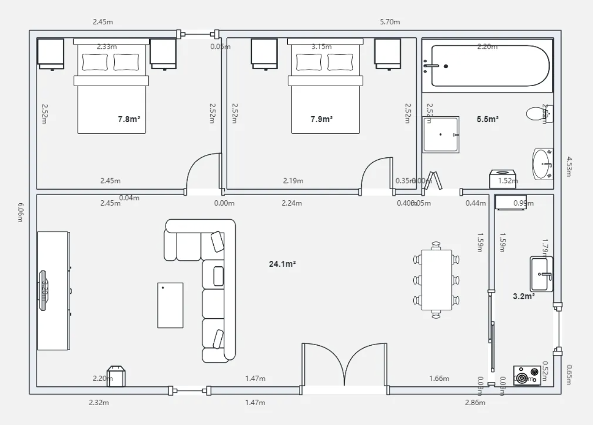<br>
<sub>Image © 2025 <a href="https://mp.weixin.qq.com/s/lrYNbs4rGs3KOqewoZ6aNQ"></a>, <a href="https://creativecommons.org/licenses/by/4.0/">CC BY 4.0</a> • Prompt by <a href="https://mp.weixin.qq.com/s/lrYNbs4rGs3KOqewoZ6aNQ"></a></sub>

**Prompt**

```
Based on the uploaded 2D floor plan, generate a professional interior design presentation board in a single image. Layout : The final image should be a collage with one large main image at the top, and several smaller images below it. Content of Each Panel :
1. Main Image (Top) : A wide-angle perspective view of the main living area , showing the connection between the living room and dining area.
2. Small Image (Bottom Left) : A view of the Master Bedroom , focusing on the bed and window.
3. Small Image (Bottom Middle) : A view of the Home Office / Study room .
4. Small Image (Bottom Right) : A 3D top-down floor plan view showing the furniture layout. Overall Style : Apply a consistent Modern Minimalist style with warm oak wood flooring and off-white walls across ALL images. Quality : Photorealistic rendering, soft natural lighting.
```


---

[⬆️ Back to Cases Directory](#cases-toc)

<a id="cases-22"></a>
### Case 22: Smart Crowd Removal (by [](https://mp.weixin.qq.com/s/lrYNbs4rGs3KOqewoZ6aNQ))

[Source Link](https://mp.weixin.qq.com/s/lrYNbs4rGs3KOqewoZ6aNQ)

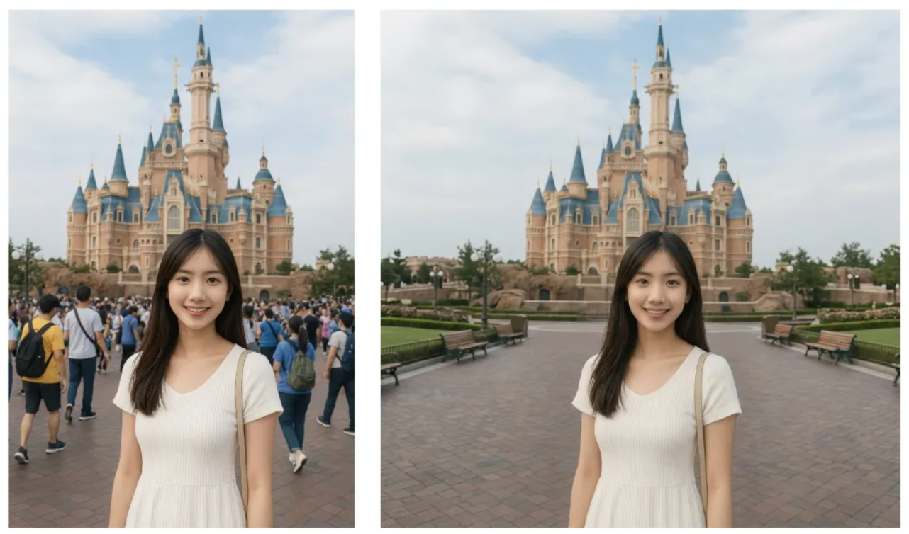<br>
<sub>Image © 2025 <a href="https://mp.weixin.qq.com/s/lrYNbs4rGs3KOqewoZ6aNQ"></a>, <a href="https://creativecommons.org/licenses/by/4.0/">CC BY 4.0</a> • Prompt by <a href="https://mp.weixin.qq.com/s/lrYNbs4rGs3KOqewoZ6aNQ"></a></sub>

**Prompt**

```
Remove all the tourists/people in the background behind the main subject. Intelligent Fill : Replace them with realistic background elements that logically fit the scene (e.g., extend the cobblestone pavement, empty park benches, or grass textures). Consistency : Ensure no blurry artifacts or 'smudges' remain. The filled area must have the same grain, focus depth, and lighting as the rest of the photo.
```


---

[⬆️ Back to Cases Directory](#cases-toc)

<a id="cases-21"></a>
### Case 21: Composition Rescue (Smart Outpainting) (by [](https://mp.weixin.qq.com/s/lrYNbs4rGs3KOqewoZ6aNQ))

[Source Link](https://mp.weixin.qq.com/s/lrYNbs4rGs3KOqewoZ6aNQ)

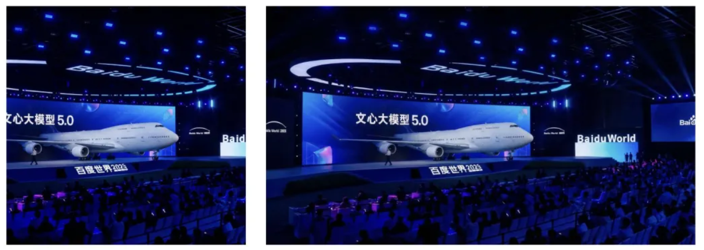<br>
<sub>Image © 2025 <a href="https://mp.weixin.qq.com/s/lrYNbs4rGs3KOqewoZ6aNQ"></a>, <a href="https://creativecommons.org/licenses/by/4.0/">CC BY 4.0</a> • Prompt by <a href="https://mp.weixin.qq.com/s/lrYNbs4rGs3KOqewoZ6aNQ"></a></sub>

**Prompt**

```
Zoom out and expand this image to a 16:9 aspect ratio (computer wallpaper size). Context Awareness : Seamlessly extend the scenery on both left and right sides. Match the original lighting, weather, and texture perfectly. Logical Completion : If there are cut-off objects (like a shoulder, a tree branch, or a building edge) on the borders, complete them naturally based on logical inference. Do not distort the original center image.
```


---

[⬆️ Back to Cases Directory](#cases-toc)

<a id="cases-20"></a>
### Case 20: Magazine Layout Generator (by [@fofrAI](https://x.com/fofrAI/status/1991530971800182929))

[Source Link](https://x.com/fofrAI/status/1991530971800182929)

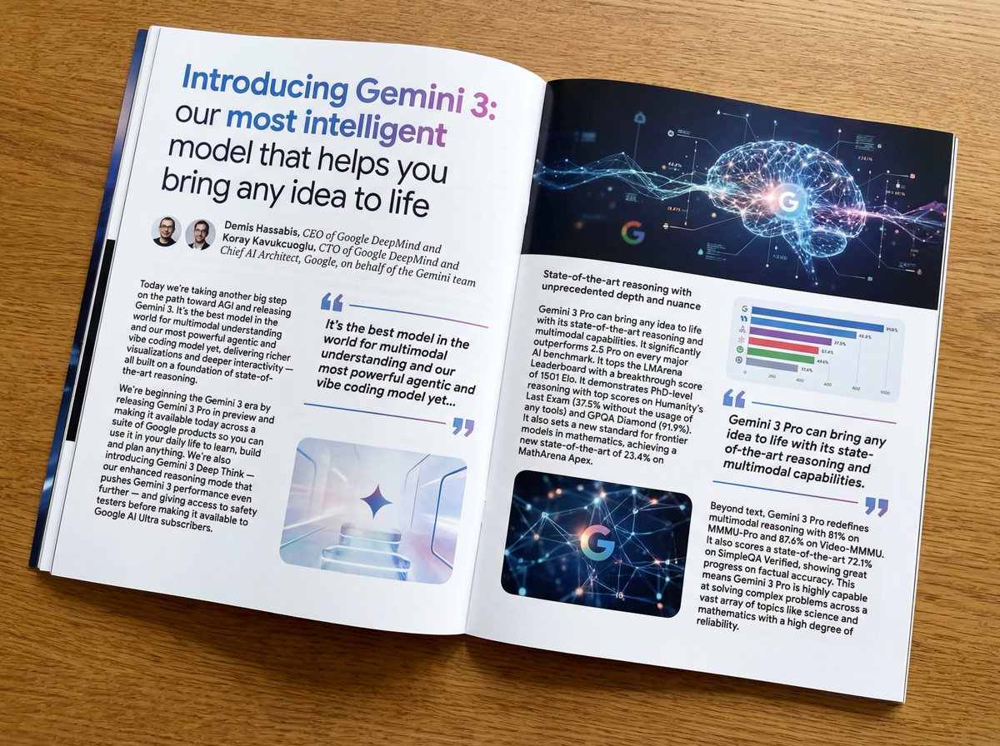<br>
<sub>Image © 2025 <a href="https://x.com/fofrAI/status/1991530971800182929">@fofrAI</a>, <a href="https://creativecommons.org/licenses/by/4.0/">CC BY 4.0</a> • Prompt by <a href="https://x.com/fofrAI/status/1991530971800182929">@fofrAI</a></sub>

**Prompt**

```
Put this whole text, verbatim, into a photo of a glossy magazine article on a desk, with photos, beautiful typography design, pull quotes and brave formatting. The text: [...the unformatted article]
```


---

[⬆️ Back to Cases Directory](#cases-toc)

<a id="cases-19"></a>
### Case 19: UI Hand-drawn Sketch to High-Fidelity Prototype (by [](https://mp.weixin.qq.com/s/lrYNbs4rGs3KOqewoZ6aNQ))

[Source Link](https://mp.weixin.qq.com/s/lrYNbs4rGs3KOqewoZ6aNQ)

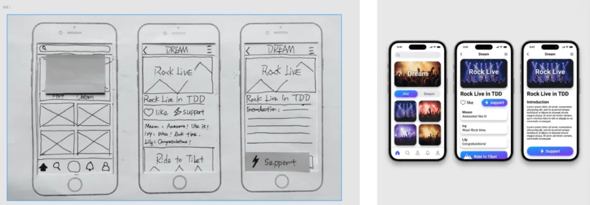<br>
<sub>Image © 2025 <a href="https://mp.weixin.qq.com/s/lrYNbs4rGs3KOqewoZ6aNQ"></a>, <a href="https://creativecommons.org/licenses/by/4.0/">CC BY 4.0</a> • Prompt by <a href="https://mp.weixin.qq.com/s/lrYNbs4rGs3KOqewoZ6aNQ"></a></sub>

**Prompt**

```
Transform this rough wireframe sketch into a high-fidelity UI design mockups for a mobile app. Design System : Apply a modern, clean aesthetics similar to iOS 18 or Material Design 3 . Use rounded corners, soft drop shadows, and a vibrant primary color. Components : Intelligently interpret the sketch: turn scribbles into high-quality placeholder images , convert rough rectangles into proper buttons with gradients , and turn lines into realistic text blocks . Layout : Ensure perfect padding and consistent spacing between elements. Context : Place the design inside a realistic iPhone 16 frame mockups.
```


---

[⬆️ Back to Cases Directory](#cases-toc)

<a id="cases-18"></a>
### Case 18: Hand-drawn Flowchart to Corporate Charts (by [](https://mp.weixin.qq.com/s/lrYNbs4rGs3KOqewoZ6aNQ))

[Source Link](https://mp.weixin.qq.com/s/lrYNbs4rGs3KOqewoZ6aNQ)

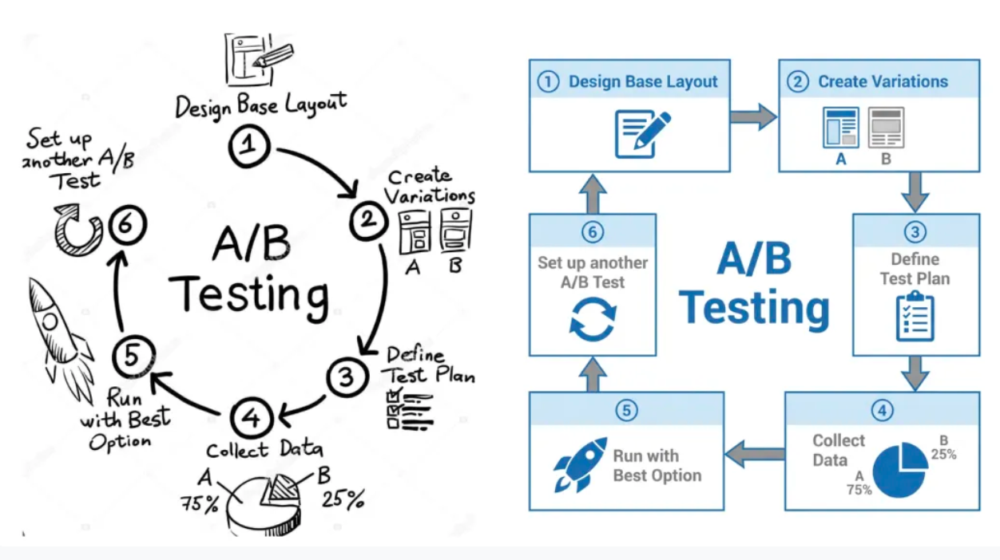<br>
<sub>Image © 2025 <a href="https://mp.weixin.qq.com/s/lrYNbs4rGs3KOqewoZ6aNQ"></a>, <a href="https://creativecommons.org/licenses/by/4.0/">CC BY 4.0</a> • Prompt by <a href="https://mp.weixin.qq.com/s/lrYNbs4rGs3KOqewoZ6aNQ"></a></sub>

**Prompt**

```
Convert this hand-drawn whiteboard sketch into a professional corporate flowchart suitable for a business presentation. Style Guide : Use a minimalist 'McKinsey-style' aesthetic : clean lines, ample whitespace, and a sophisticated blue-and-gray color palette. Structure : Automatically align all boxes and diamonds to a strict grid . Connect them with straight, orthogonal arrows (90-degree angles only, no curvy lines). Text : Transcribe the handwritten labels into a clear, bold Sans-Serif font (like Arial or Roboto). Output : High-resolution vector-style image on a pure white background.
```


---

[⬆️ Back to Cases Directory](#cases-toc)

<a id="cases-17"></a>
### Case 17: Professional Product Photography (by [](https://mp.weixin.qq.com/s/lrYNbs4rGs3KOqewoZ6aNQ))

[Source Link](https://mp.weixin.qq.com/s/lrYNbs4rGs3KOqewoZ6aNQ)

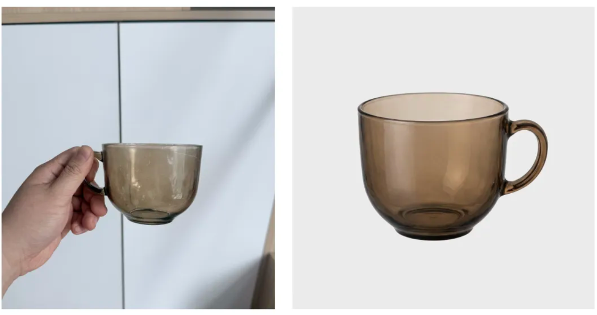<br>
<sub>Image © 2025 <a href="https://mp.weixin.qq.com/s/lrYNbs4rGs3KOqewoZ6aNQ"></a>, <a href="https://creativecommons.org/licenses/by/4.0/">CC BY 4.0</a> • Prompt by <a href="https://mp.weixin.qq.com/s/lrYNbs4rGs3KOqewoZ6aNQ"></a></sub>

**Prompt**

```
Identify the main product in the uploaded photo (automatically removing any hands holding it or messy background details). Recreate it as a premium e-commerce product shot . Subject Isolation : Cleanly extract the product, completely removing any fingers, hands, or clutter . Background : Place the product on a pure white studio background (RGB 255, 255, 255) with a subtle, natural contact shadow at the base to ground it. Lighting : Use soft, commercial studio lighting to highlight the product's texture and material. Ensure even illumination with no harsh glare. Retouching : Automatically fix any lens distortion, improve sharpness, and color-correct to make the product look brand new and professional .
```


---

[⬆️ Back to Cases Directory](#cases-toc)

<a id="cases-16"></a>
### Case 16: Virtual Model Try-On (by [](https://mp.weixin.qq.com/s/lrYNbs4rGs3KOqewoZ6aNQ))

[Source Link](https://mp.weixin.qq.com/s/lrYNbs4rGs3KOqewoZ6aNQ)

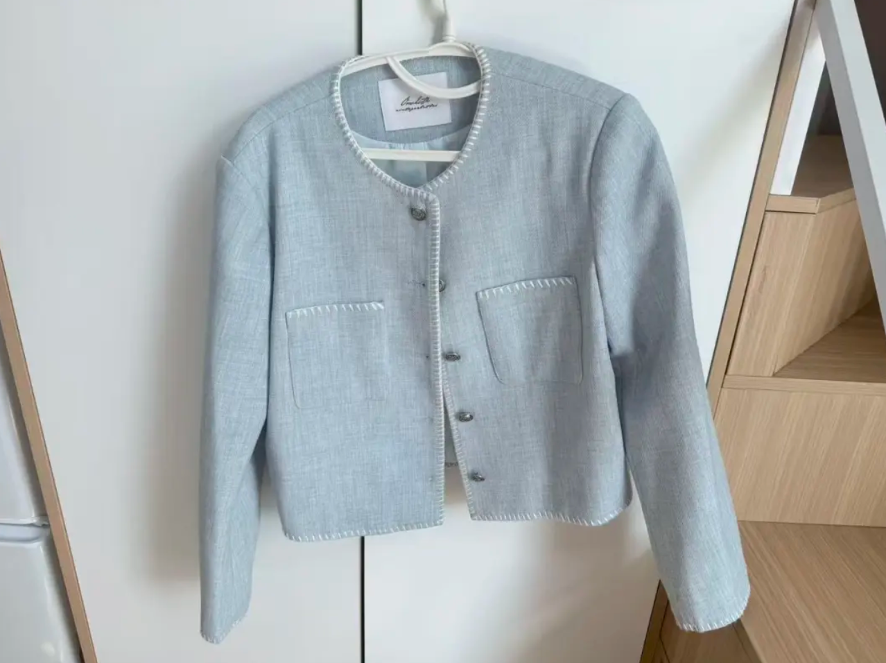<br>
<sub>Image © 2025 <a href="https://mp.weixin.qq.com/s/lrYNbs4rGs3KOqewoZ6aNQ"></a>, <a href="https://creativecommons.org/licenses/by/4.0/">CC BY 4.0</a> • Prompt by <a href="https://mp.weixin.qq.com/s/lrYNbs4rGs3KOqewoZ6aNQ"></a></sub>

**Prompt**

```
Using Image 1 (the garment) and Image 2 (the model), create a hyper-realistic full-body fashion photo where the model is wearing the garment. Crucial Fit Details : The [T-shirt/Jacket] must drape naturally on the model's body, conforming to their posture and creating realistic folds and wrinkles . High-Fidelity Preservation : Preserve the original fabric texture, color, and any logos from Image 1 with extreme accuracy. Seamless Integration : Blend the garment into Image 2 by perfectly matching the ambient lighting, color temperature, and shadow direction . Photography Style : Clean e-commerce lookbook, shot on a Canon EOS R5 with a 50mm f/1.8 lens for a natural, professional look.
```


---

[⬆️ Back to Cases Directory](#cases-toc)

<a id="cases-15"></a>
### Case 15: Concept Visualization (Text to Infographic) (by [](https://mp.weixin.qq.com/s/lrYNbs4rGs3KOqewoZ6aNQ))

[Source Link](https://mp.weixin.qq.com/s/lrYNbs4rGs3KOqewoZ6aNQ)

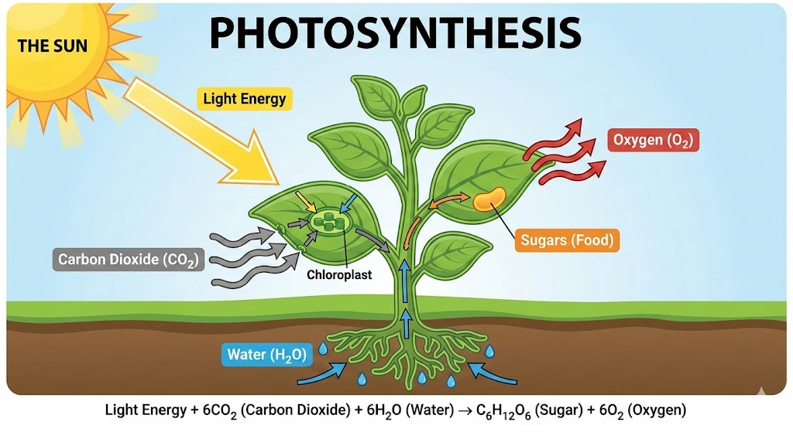<br>
<sub>Image © 2025 <a href="https://mp.weixin.qq.com/s/lrYNbs4rGs3KOqewoZ6aNQ"></a>, <a href="https://creativecommons.org/licenses/by/4.0/">CC BY 4.0</a> • Prompt by <a href="https://mp.weixin.qq.com/s/lrYNbs4rGs3KOqewoZ6aNQ"></a></sub>

**Prompt**

```
Create an educational infographic explaining [Photosynthesis] . Visual Elements : Illustrate the key components: The Sun, a green Plant, Water (H2O) entering roots, Carbon Dioxide (CO2) entering leaves, and Oxygen (O2) being released. Style : Clean, flat vector illustration suitable for a high school science textbook. Use arrows to show the flow of energy and matter. Labels : Label each element clearly in English .
```


---

[⬆️ Back to Cases Directory](#cases-toc)

<a id="cases-14"></a>
### Case 14: Whiteboard Marker Art (by [@nicdunz](https://x.com/nicdunz/status/1991556910106177849))

[Source Link](https://x.com/nicdunz/status/1991556910106177849)

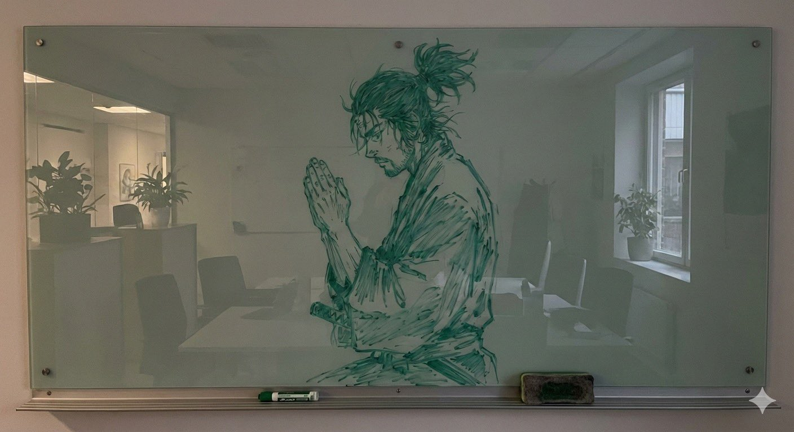<br>
<sub>Image © 2025 <a href="https://x.com/nicdunz/status/1991556910106177849">@nicdunz</a>, <a href="https://creativecommons.org/licenses/by/4.0/">CC BY 4.0</a> • Prompt by <a href="https://x.com/nicdunz/status/1991556910106177849">@nicdunz</a></sub>

**Prompt**

```
Create a photo of vagabonds musashi praying drawn on a glass whiteboard in a slightly faded green marker
```


---

[⬆️ Back to Cases Directory](#cases-toc)

<a id="cases-13"></a>
### Case 13: Multi-Subject Compositing (by [](https://replicate.com/))

[Source Link](https://replicate.com/)

<br>
<sub>Image © 2025 <a href="https://replicate.com/"></a>, <a href="https://creativecommons.org/licenses/by/4.0/">CC BY 4.0</a> • Prompt by <a href="https://replicate.com/"></a></sub>

**Prompt**

```
an office team photo, everyone making a silly face
```


---

[⬆️ Back to Cases Directory](#cases-toc)

<a id="cases-12"></a>
### Case 12: Literal Interpretation (by [](https://replicate.com/))

[Source Link](https://replicate.com/)

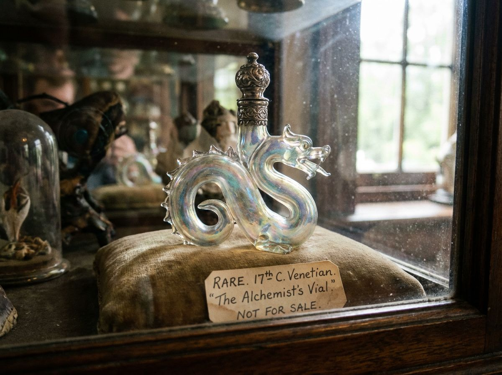<br>
<sub>Image © 2025 <a href="https://replicate.com/"></a>, <a href="https://creativecommons.org/licenses/by/4.0/">CC BY 4.0</a> • Prompt by <a href="https://replicate.com/"></a></sub>

**Prompt**

```
rare.jpg
```


---

[⬆️ Back to Cases Directory](#cases-toc)

<a id="cases-11"></a>
### Case 11: Conceptual Visualization (by [](https://replicate.com/))

[Source Link](https://replicate.com/)

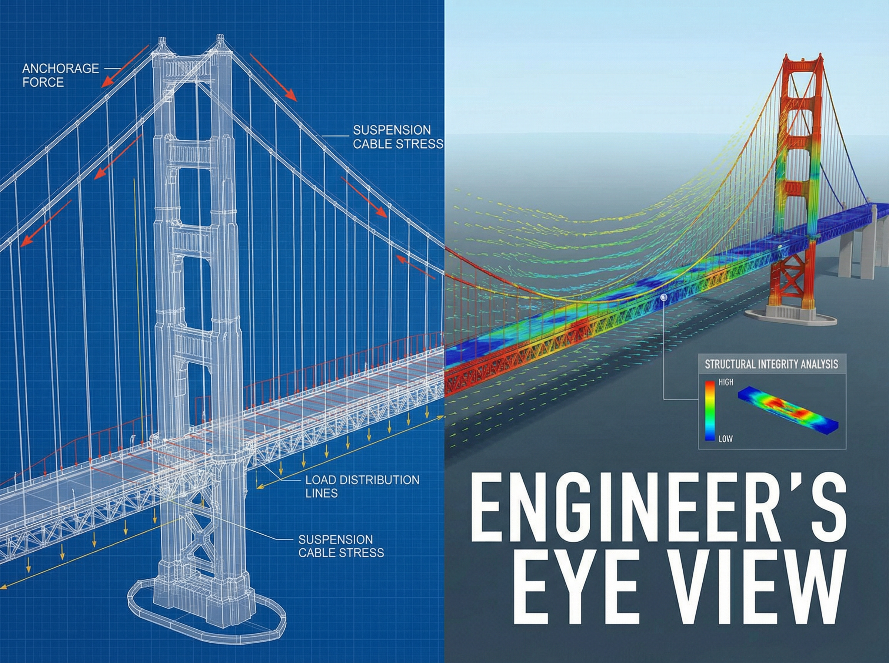<br>
<sub>Image © 2025 <a href="https://replicate.com/"></a>, <a href="https://creativecommons.org/licenses/by/4.0/">CC BY 4.0</a> • Prompt by <a href="https://replicate.com/"></a></sub>

**Prompt**

```
How engineers see the San Francisco Bridge
```


---

[⬆️ Back to Cases Directory](#cases-toc)

<a id="cases-10"></a>
### Case 10: Coordinate Visualization (by [](https://replicate.com/))

[Source Link](https://replicate.com/)

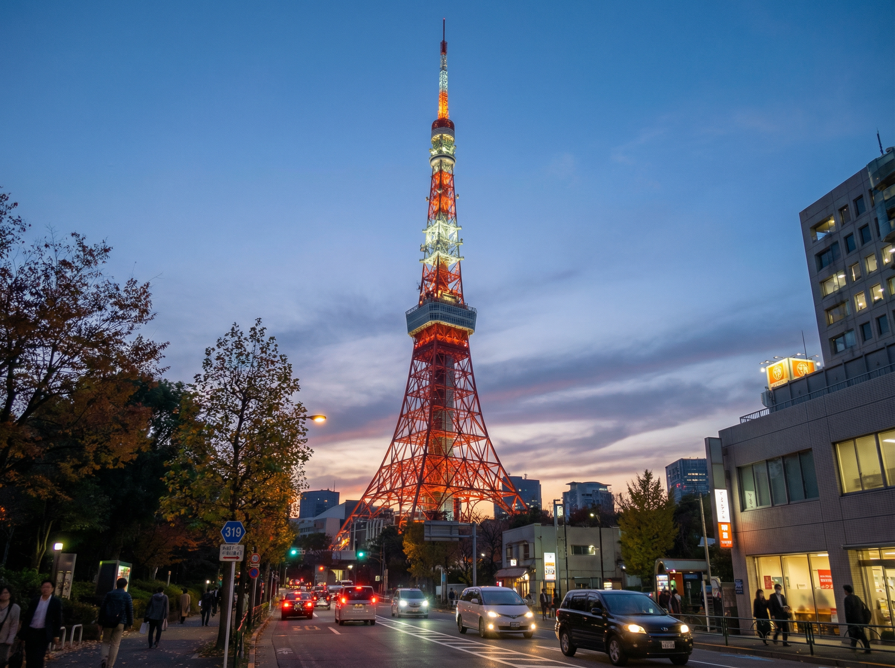<br>
<sub>Image © 2025 <a href="https://replicate.com/"></a>, <a href="https://creativecommons.org/licenses/by/4.0/">CC BY 4.0</a> • Prompt by <a href="https://replicate.com/"></a></sub>

**Prompt**

```
35.6586° N, 139.7454° E at 19:00
```


---

[⬆️ Back to Cases Directory](#cases-toc)

<a id="cases-9"></a>
### Case 9: Recursive Visuals (by [@venturetwins](https://x.com/venturetwins/status/1993174445515772086))

[Source Link](https://x.com/venturetwins/status/1993174445515772086)

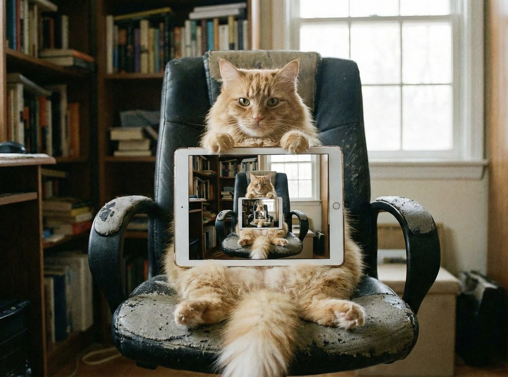<br>
<sub>Image © 2025 <a href="https://x.com/venturetwins/status/1993174445515772086">@venturetwins</a>, <a href="https://creativecommons.org/licenses/by/4.0/">CC BY 4.0</a> • Prompt by <a href="https://x.com/venturetwins/status/1993174445515772086">@venturetwins</a></sub>

**Prompt**

```
recursive image of an orange cat sitting in an office chair holding up an iPad. On the iPad is the same cat in the same scene holding up the same iPad. Repeated on each iPad.
```


---

[⬆️ Back to Cases Directory](#cases-toc)

<a id="cases-8"></a>
### Case 8: Aging Through the Years (by [@dr_cintas](https://x.com/dr_cintas/status/1991888364099035581?s=20))

[Source Link](https://x.com/dr_cintas/status/1991888364099035581?s=20)

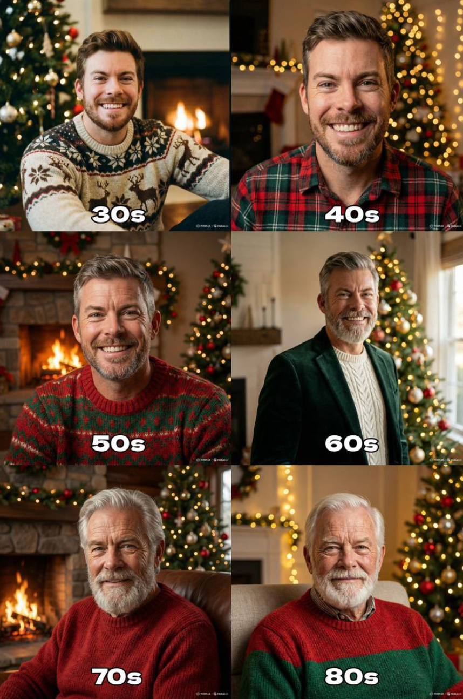<br>
<sub>Image © 2025 <a href="https://x.com/dr_cintas/status/1991888364099035581?s=20">@dr_cintas</a>, <a href="https://creativecommons.org/licenses/by/4.0/">CC BY 4.0</a> • Prompt by <a href="https://x.com/dr_cintas/status/1991888364099035581?s=20">@dr_cintas</a></sub>

**Prompt**

```
"Generate the holiday photo of this person through the ages up to 80 years old"
```


---

[⬆️ Back to Cases Directory](#cases-toc)

<a id="cases-7"></a>
### Case 7: Star Wars "Where's Waldo" (by [@creacas](https://x.com/creacas/status/1991585587548348513?s=20))

[Source Link](https://x.com/creacas/status/1991585587548348513?s=20)

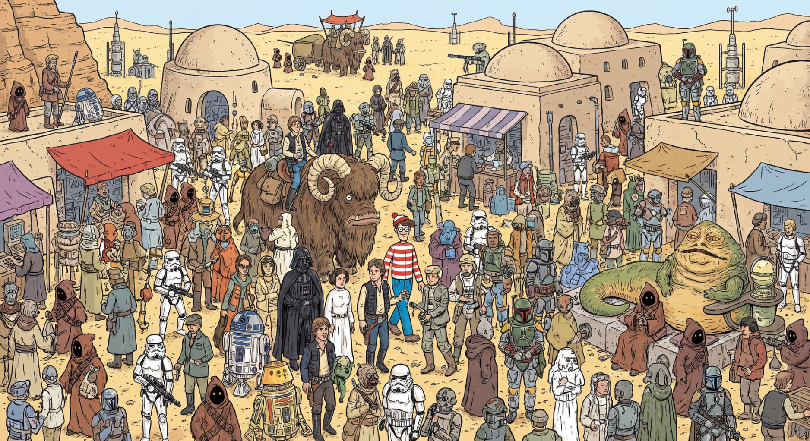<br>
<sub>Image © 2025 <a href="https://x.com/creacas/status/1991585587548348513?s=20">@creacas</a>, <a href="https://creativecommons.org/licenses/by/4.0/">CC BY 4.0</a> • Prompt by <a href="https://x.com/creacas/status/1991585587548348513?s=20">@creacas</a></sub>

**Prompt**

```
A where is waldo image showing all Star Wars characters on Tatooine

First one to pull this off. First take. Even Waldo is there.
```


---

[⬆️ Back to Cases Directory](#cases-toc)

<a id="cases-6"></a>
### Case 6: Emotional Film Photography (by [](https://mp.weixin.qq.com/s/lrYNbs4rGs3KOqewoZ6aNQ))

[Source Link](https://mp.weixin.qq.com/s/lrYNbs4rGs3KOqewoZ6aNQ)

<br>
<sub>Image © 2025 <a href="https://mp.weixin.qq.com/s/lrYNbs4rGs3KOqewoZ6aNQ"></a>, <a href="https://creativecommons.org/licenses/by/4.0/">CC BY 4.0</a> • Prompt by <a href="https://mp.weixin.qq.com/s/lrYNbs4rGs3KOqewoZ6aNQ"></a></sub>

**Prompt**

```
Keep the facial features of the person in the uploaded image exactly consistent . Style : A cinematic, emotional portrait shot on Kodak Portra 400 film . Setting : An urban street coffee shop window at Golden Hour (sunset) . Warm, nostalgic lighting hitting the side of the face. Atmosphere : Apply a subtle film grain and soft focus to create a dreamy, storytelling vibe. Action : The subject is looking slightly away from the camera, holding a coffee cup, with a relaxed, candid expression. Details : High quality, depth of field, bokeh background of city lights.
```


---

[⬆️ Back to Cases Directory](#cases-toc)

<a id="cases-5"></a>
### Case 5: One-Click Business Photo (Silicon Valley Style) (by [](https://mp.weixin.qq.com/s/lrYNbs4rGs3KOqewoZ6aNQ))

[Source Link](https://mp.weixin.qq.com/s/lrYNbs4rGs3KOqewoZ6aNQ)

<br>
<sub>Image © 2025 <a href="https://mp.weixin.qq.com/s/lrYNbs4rGs3KOqewoZ6aNQ"></a>, <a href="https://creativecommons.org/licenses/by/4.0/">CC BY 4.0</a> • Prompt by <a href="https://mp.weixin.qq.com/s/lrYNbs4rGs3KOqewoZ6aNQ"></a></sub>

**Prompt**

```
Keep the facial features of the person in the uploaded image exactly consistent . Dress them in a professional navy blue business suit with a white shirt, similar to the reference image. Background : Place the subject against a clean, solid dark gray studio photography backdrop . The background should have a subtle gradient , slightly lighter behind the subject and darker towards the edges (vignette effect). There should be no other objects. Photography Style : Shot on a Sony A7III with an 85mm f/1.4 lens , creating a flattering portrait compression. Lighting : Use a classic three-point lighting setup . The main key light should create soft, defining shadows on the face. A subtle rim light should separate the subject's shoulders and hair from the dark background. Crucial Details : Render natural skin texture with visible pores , not an airbrushed look. Add natural catchlights to the eyes . The fabric of the suit should show a subtle wool texture.Final image should be an ultra-realistic, 8k professional headshot.
```


---

[⬆️ Back to Cases Directory](#cases-toc)

<a id="cases-4"></a>
### Case 4: 1990s Camera Style Portrait (by [@kingofdairyque](https://x.com/kingofdairyque/status/1991780760030961768?s=20))

[Source Link](https://x.com/kingofdairyque/status/1991780760030961768?s=20)

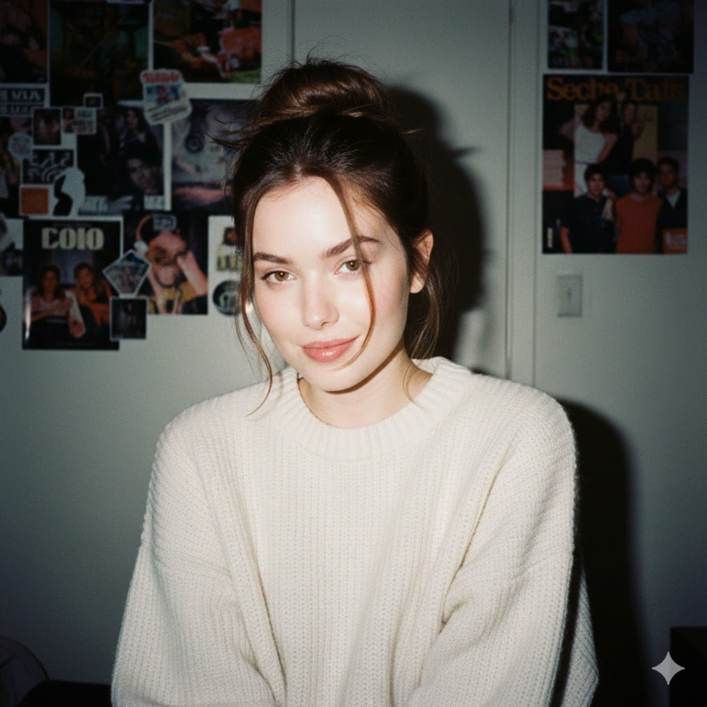<br>
<sub>Image © 2025 <a href="https://x.com/kingofdairyque/status/1991780760030961768?s=20">@kingofdairyque</a>, <a href="https://creativecommons.org/licenses/by/4.0/">CC BY 4.0</a> • Prompt by <a href="https://x.com/kingofdairyque/status/1991780760030961768?s=20">@kingofdairyque</a></sub>

**Prompt**

```
Without changing her original face, create a portrait of a beautiful young woman with porcelain-white skin, captured with a 1990s-style camera using a direct front flash. Her messy dark brown hair is tied up, posing with a calm yet playful smile. She wears a modern oversized cream sweater. The background is a dark white wall covered with aesthetic magazine posters and stickers, evoking a cozy bedroom or personal room atmosphere under dim lighting. The 35mm lens flash creates a nostalgic glow.
```


---

[⬆️ Back to Cases Directory](#cases-toc)

<a id="cases-3"></a>
### Case 3: Victoria's Secret Style Photoshoot (by [@NanoBanana_labs](https://x.com/NanoBanana_labs/status/1991947916479762788?s=20))

[Source Link](https://x.com/NanoBanana_labs/status/1991947916479762788?s=20)

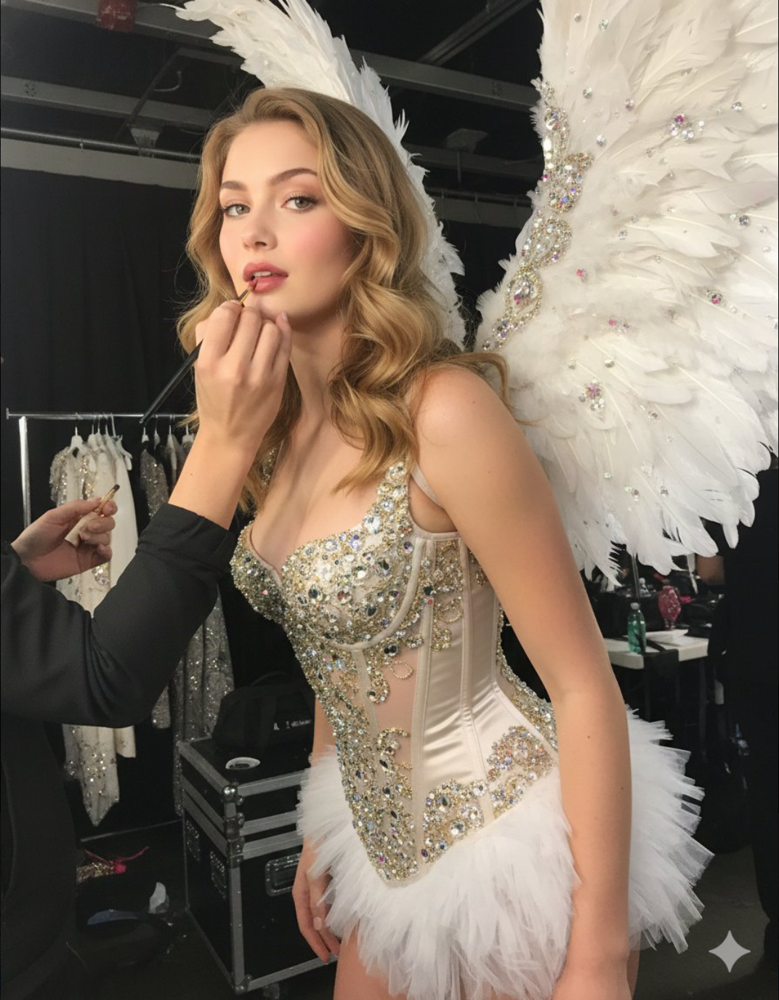<br>
<sub>Image © 2025 <a href="https://x.com/NanoBanana_labs/status/1991947916479762788?s=20">@NanoBanana_labs</a>, <a href="https://creativecommons.org/licenses/by/4.0/">CC BY 4.0</a> • Prompt by <a href="https://x.com/NanoBanana_labs/status/1991947916479762788?s=20">@NanoBanana_labs</a></sub>

**Prompt**

```
Create a glamorous photoshoot in the style of Victoria's Secret. A young woman attached in the uploaded reference image ( Keep the face of the person 100% accurate from the reference image ) stands almost sideways, slightly bent forward, during the final preparation for the show. Makeup artists apply lipstick to her (only her hands are visible in the frame). She is wearing a corset decorated with beaded embroidery and crystals with a short fluffy skirt, as well as large feather wings. The image has a "backstage" effect.

The background is a darkly lit room, probably under the podium. The main emphasis is on the girl's face and the details of her costume. Emphasize the expressiveness of the gaze and the luxurious look of the outfit. The photo is lit by a flash from the camera, which emphasizes the shine of the beads and crystals on the corset, as well as the girl's shiny skin. Victoria's Secret style: sensuality, luxury, glamour. Very detailed. Important: do not change the face.
```


---

[⬆️ Back to Cases Directory](#cases-toc)

<a id="cases-2"></a>
### Case 2: 2000s Mirror Selfie (by [@ZaraIrahh](https://x.com/ZaraIrahh/status/1991681614368436468?s=20))

[Source Link](https://x.com/ZaraIrahh/status/1991681614368436468?s=20)

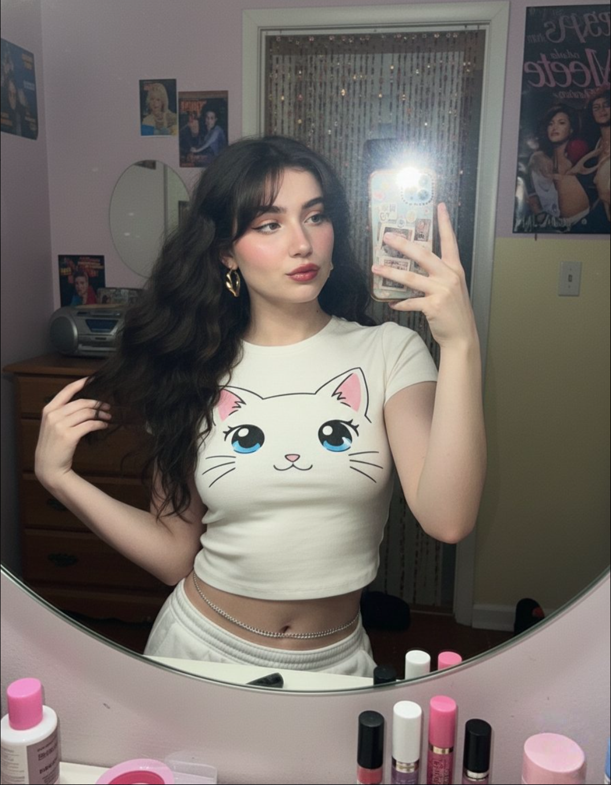<br>
<sub>Image © 2025 <a href="https://x.com/ZaraIrahh/status/1991681614368436468?s=20">@ZaraIrahh</a>, <a href="https://creativecommons.org/licenses/by/4.0/">CC BY 4.0</a> • Prompt by <a href="https://x.com/ZaraIrahh/status/1991681614368436468?s=20">@ZaraIrahh</a></sub>

**Prompt**

```
Create a 2000s Mirror Selfie of yourself using Gemini Nano Banana.

{
  "subject": {
    "description": "A young woman taking a mirror selfie with very long voluminous dark waves and soft wispy bangs",
    "age": "young adult",
    "expression": "confident and slightly playful",
    "hair": {
      "color": "dark",
      "style": "very long, voluminous waves with soft wispy bangs"
    },
    "clothing": {
      "top": {
        "type": "fitted cropped t-shirt",
        "color": "cream white",
        "details": "features a large cute anime-style cat face graphic with big blue eyes, whiskers, and a small pink mouth"
      }
    },
    "face": {
      "preserve_original": true,
      "makeup": "natural glam makeup with soft pink dewy blush and glossy red pouty lips"
    }
  },
  "accessories": {
    "earrings": {
      "type": "gold geometric hoop earrings"
    },
    "jewelry": {
      "waistchain": "silver waistchain"
    },
    "device": {
      "type": "smartphone",
      "details": "patterned case"
    }
  },
  "photography": {
    "camera_style": "early-2000s digital camera aesthetic",
    "lighting": "harsh super-flash with bright blown-out highlights but subject still visible",
    "angle": "mirror selfie",
    "shot_type": "tight selfie composition",
    "texture": "subtle grain, retro highlights, V6 realism, crisp details, soft shadows"
  },
  "background": {
    "setting": "nostalgic early-2000s bedroom",
    "wall_color": "pastel tones",
    "elements": [
      "chunky wooden dresser",
      "CD player",
      "posters of 2000s pop icons",
      "hanging beaded door curtain",
      "cluttered vanity with lip glosses"
    ],
    "atmosphere": "authentic 2000s nostalgic vibe",
    "lighting": "retro"
  }
}
```


---

[⬆️ Back to Cases Directory](#cases-toc)

<a id="cases-1"></a>
### Case 1: Hyper-Realistic Crowd Composition (by [@SebJefferies](https://x.com/SebJefferies/status/1991531687147360728))

[Source Link](https://x.com/SebJefferies/status/1991531687147360728)

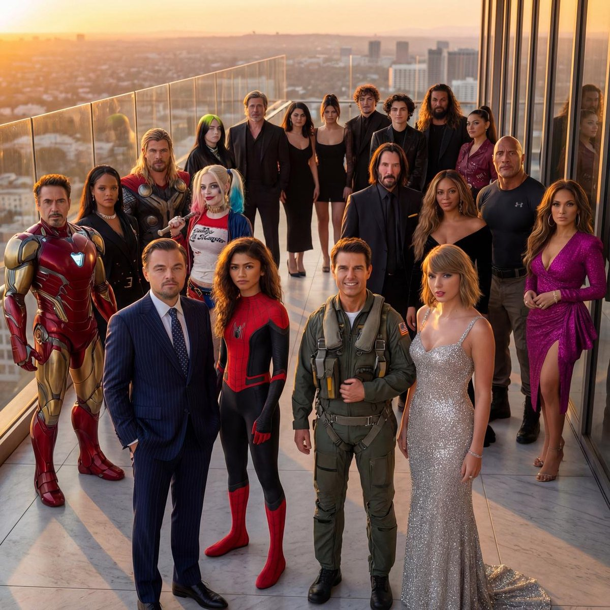<br>
<sub>Image © 2025 <a href="https://x.com/SebJefferies/status/1991531687147360728">@SebJefferies</a>, <a href="https://creativecommons.org/licenses/by/4.0/">CC BY 4.0</a> • Prompt by <a href="https://x.com/SebJefferies/status/1991531687147360728">@SebJefferies</a></sub>

**Prompt**

```
Create a hyper-realistic, ultra-sharp, full-color large-format image featuring a massive group of celebrities from different eras, all standing together in a single wide cinematic frame. The image must look like a perfectly photographed editorial cover with impeccable lighting, lifelike skin texture, micro-details of hair, pores, reflections, and fabric fibers.

GENERAL STYLE & MOOD: Photorealistic, 8k, shallow depth of field, soft natural fill light + strong golden rim light. High dynamic range, calibrated color grading. Skin tones perfectly accurate. Crisp fabric detail with individual threads visible. Balanced composition, slightly wide-angle lens (35mm), center-weighted. All celebrities interacting naturally, smiling, posing, or conversing. Minimal background noise, but with enough world-building to feel real.

THE ENVIRONMENT: A luxurious open-air rooftop terrace at sunset overlooking a modern city skyline. Elements include: Warm golden light wrapping around silhouettes. Polished marble.
```


---

[⬆️ Back to Cases Directory](#cases-toc)


---

<a id="tools-intro"></a>
## 🛠️ Tools Introduction

Here are applications where you can use the Nano Banana Pro model to generate images:

### Official Platform

- **🔷 [Google Gemini](https://gemini.google.com):** The official platform for Nano Banana and Nano Banana Pro, providing powerful multimodal AI capabilities, supporting text-to-image generation and image editing features.

### Excellent Third-Party Community Platforms

- **🌐 [Sovibe.org](https://sovibe.org):** Excellent third-party community platform. Use Nano Banana Pro to generate high-quality images with support for multiple styles and detailed control, suitable for creative expression and content creation.

- **🤖 [Nano Banana AI](https://ai-nanobanana.com):** Excellent third-party community platform. Generate realistic images via Nano Banana Pro, supporting text-image combination and scene reconstruction, suitable for visual creative scenarios like film and animation.


<a id="prompting-tips"></a>
## 💡 Prompting Tips

1. [Prompt Engineering (PDF)](https://s.baoyu.io/files/2025-01-18-pdf-1-TechAI-Goolge-whitepaper_Prompt%20Engineering_v4-af36dcc7a49bb7269a58b1c9b89a8ae1.pdf) by Google
2. [Introducing 4o Image Generation](https://openai.com/index/introducing-4o-image-generation) by OpenAI


<a id="how-to-contribute"></a>
## 🤝 How to Contribute

There are two ways to contribute, please read [CONTRIBUTING.md](./CONTRIBUTING.md).


<a id="acknowledgements"></a>
## 🙏 Acknowledgements

The content of this collection heavily relies on the creative prompts and wonderful visuals shared by the AI community on Twitter/X and Gemini. We express our sincere gratitude to all contributors of these cases. 😊

Special thanks to the following users for sharing their inspiring work ✨:

{{#authors}}
*   [{{{name}}}]({{{link}}})
{{/authors}}

{{^authors}}
*   No case data available
{{/authors}}

And other creators whose prompts may have been included through retweets or indirect shares.

If your work is included here and you wish to change the attribution or have it removed, please feel free to contact us. ✉️

[⬆️ Back to Top](#readme-top)


<a id="sponsored"></a>
## 💰 Sponsored

This project is sponsored by [Sovibe.org](https://sovibe.org).

Sovibe.org is a platform focused on AI image generation, providing powerful Nano Banana Pro models to help creators easily generate high-quality images.

<div align="CENTER">
  <strong>Sponsored by <a href="https://sovibe.org">Sovibe.org</a></strong>
</div>

[⬆️ Back to Top](#readme-top)


<a id="star-history"></a>
## 🌟 Star History

[](https://www.star-history.com/#linksee-dev/awesome-nano-banana-pro-prompt&Date)

[⬆️ Back to Top](#readme-top)

